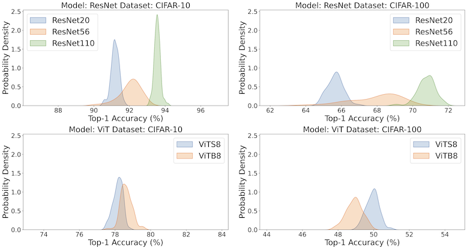

# measuring-deep-learning-performance

Code and results for the paper:

**Measuring Deep Learning Performance - An Empirical Study of Performance Distributions Across Architectures and Tasks**

Kevin L. Coakley & Odd Erik Gundersen

*Scientific Reports* (2026). https://doi.org/10.1038/s41598-026-49656-z

## Abstract

Non-determinism in deep learning algorithm design and implementation leads to performance variation, meaning model performance is not a single value, but rather a distribution. These model performance distributions are underexplored despite their impact on robustness. We investigate the robustness of deep learning performance to sources of non-determinism, specifically focusing on how performance distributions differ across various architectures and tasks. We conducted 186 experiments on state-of-the-art image classification (ResNet, ViT) and time series forecasting (Autoformer, iTransformer, NLinear, TSMixer) architectures. 
Each experiment was run 100 times with different random seeds to generate performance distributions, resulting in 18,600 runs. Robustness was quantified using metrics for spread, symmetry, and tail risk. Performance distributions are frequently non-Gaussian, particularly in time series forecasting. Model size does not systematically affect robustness -- larger image classification models show fewer outliers but not lower spread, while smaller time series models show lower spread but more extreme underperformers. Training duration does not scale linearly; early stopping effectively balances performance and robustness. Mean performance does not predict robustness -- time series forecasting shows moderate correlation while image classification shows none. Time series models produce nearly three times more underperforming outliers than image classification models, indicating substantially higher tail risk. Tail risk poses serious concerns for Trustworthy AI in high-stakes applications.  Models performing well on average may exhibit long tails and extreme outliers revealed only through distributional analysis. Mean performance alone should not guide model selection; assessment of spread, symmetry, and tail risk is essential for reliable model assessment where consistent performance is critical.


*Figure 1: Kernel density estimates of top-1 accuracy for image classification models on CIFAR-10 (left) and CIFAR-100 (right). Top row shows ResNet architectures (ResNet20, ResNet56, ResNet110); bottom row shows Vision Transformers (ViT-S-8, ViT-B-8). Each curve represents the distribution across 100 random seeds for a single model-dataset pair.*

## Repository Structure

```
code/image_classification/ : Code for training and evaluating deep learning models on image classification tasks.

code/time_series/ : Code for training and evaluating deep learning models on time series data.

dataset_preprocess/ : Scripts for preprocessing datasets used in the image classification experiments.

notebooks/ : Jupyter notebooks for analysis and visualization of results.

results/image_classification/ : Results from image classification experiments.
results/time_series/ : Results from time series experiments.

scopus/ : Scopus search results for visualizing research trends in deep learning.

templates/seed-wrapper/ : Script to generate the training of the 100 seed replicates.

templates/singularity/ : Singularity definition files for creating containerized environments.

templates/slurm/ : SLURM job scripts for running experiments on a computing cluster.
```

## Citation
 
```bibtex
@article{coakley2026measuring,
  title={Measuring deep learning performance - an empirical study of performance distributions across architectures and tasks},
  author={Coakley, Kevin L. and Gundersen, Odd Erik},
  journal={Scientific Reports},
  year={2026},
  publisher={Nature Publishing Group UK London},
  doi={10.1038/s41598-026-49656-z}
}
```
